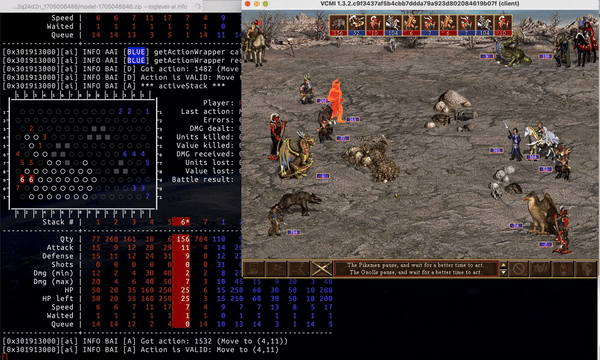

# VCMI Project (AI fork)

This is a fork of VCMI which adapts the game for AI development purposes and is part of the [vcmi-gym](https://github.com/smanolloff/vcmi-gym) project.

List of features I would like to have implemented at this point:

| Feature | Status | Rationale |
| ------- | ------ | --------- |
| Headless mode | ✅ | Disabling GUI improves performance |
| Multi-VCMI mode | ✅ | Running multiple VCMI processes simultaneously is essential for efficient training |
| Only battles | ✅ | Anything not related to battles is out of scope |
| Quick restarts | ✅ | Re-starting only the battle instead of the entire game improves performance |
| Action injection | ✅ | The actions to take are produced by separate program and must be passed to VCMI for execution |
| State reporting | ✅ | VCMI must collect important aspects of the battle's state and communicate them to a separate program |
| Map hot-swap | ❌ | Changing the map without restarting VCMI would improve training performance |
| Battlefield hot-swap | ❌ | Changing the battlefield terrain without re-starting VCMI on a new map would improve performance|
| Army hot-swap | ❌ | Changing the army compositions without re-starting VCMI on a new map would improve performance |

Being an work-in-progress, this VCMI fork contains many non-portable changes which will cause problems on a non-macOS environment (this will be addressed at a later stages of the development).

One instance of the game can currently handle ~300 actions/s (or ~10 battles/s for an average battle comp of 5 stacks per side).
