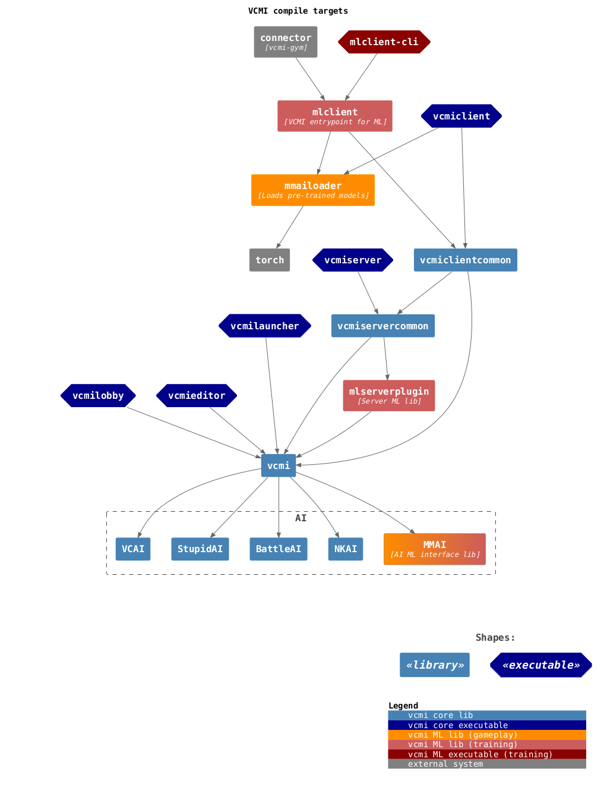

This is a fork of VCMI which adapts the game for AI development purposes and is
part of the [vcmi-gym](https://github.com/smanolloff/vcmi-gym) project.

## Project state

Ready to be submitted as a contribution to [VCMI](https://github.com/vcmi/vcmi)
(no official PRs as of yet, but preliminary discussions have already taken place).

Here is a list of features needed for ML purposes:

| Feature | Status | Rationale |
| ------- | ------ | --------- |
| Headless mode | ✅ | Disabling GUI improves performance |
| Multi-VCMI mode | ✅ | Running multiple VCMI processes simultaneously is essential for efficient training |
| Only battles | ✅ | Anything not related to battles is out of scope |
| Quick restarts | ✅ | Re-starting only the battle instead of the entire game improves performance |
| Real restarts | ❌ | Re-starting is currently implemented via a Retreat action which was hard-coded to be always allowed |
| Action injection | ✅ | The actions to take are produced by separate program and must be passed to VCMI for execution |
| State reporting | ✅ | VCMI must collect important aspects of the battle's state and communicate them to a separate program |
| Map hot-swap | ❌ | Changing the map without restarting VCMI is one way change the army compositions during training, which would improve training performance |
| Battlefield hot-swap | ✅ | Changing the battlefield terrain without changing the entire map (hence re-starting VCMI) would improve performance|
| Army hot-swap | ✅ | Changing the army compositions without changing the entire map (hence re-starting VCMI) would improve performance |
| Battle side hot-swap | ✅ | Changing battle side (attacker/defender) without changing the entire map (hence re-starting VCMI) would improve performance |
| Battle recording+replaying | ❌ | Being able to record battles played by humans could enable new AI training methods (imitation-based learning) |

## Project architecture

In order to allow for easy integration into the core VCMI, the ML features are
abstracted out as separate build targets, optionally excluded based on
compile-time flags and tracked as git submodules:

## Documentation

* For MacOS, please refer to [this setup guide](./setup_macos.md)
* For Linux/Ubuntu OS, please refer to [this setup guide](./setup_ubuntu.md)
* For Windows, there is none (yet). Contributions are welcome.

## Contributing

You are most welcome to help with this project. Most notably, if you can help
with the features listed above, it would be great.

If you decide to contribute, please follow these
[guidelines](https://github.com/smanolloff/vcmi-gym).
